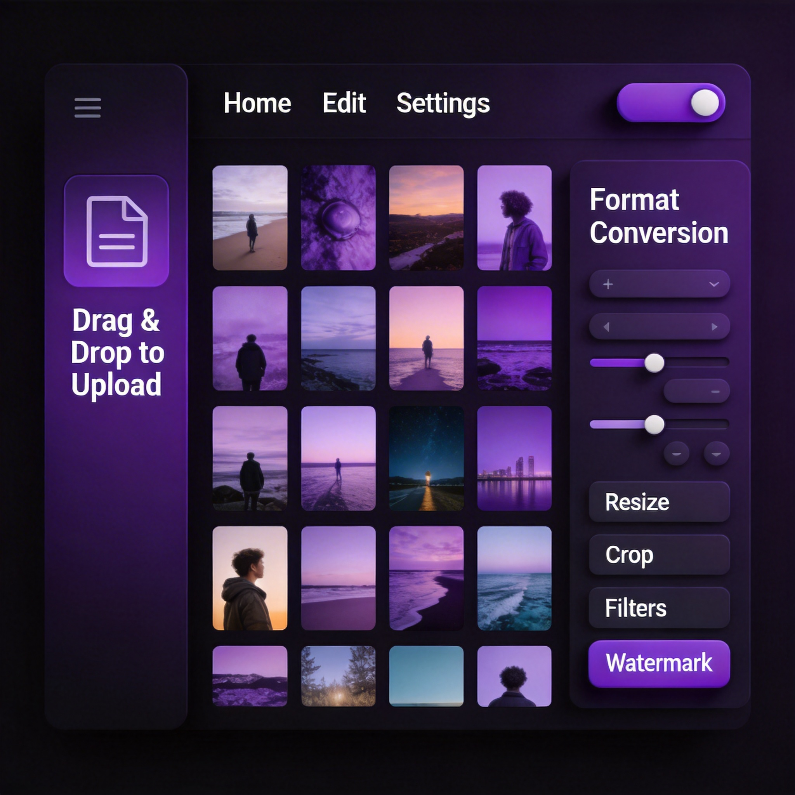
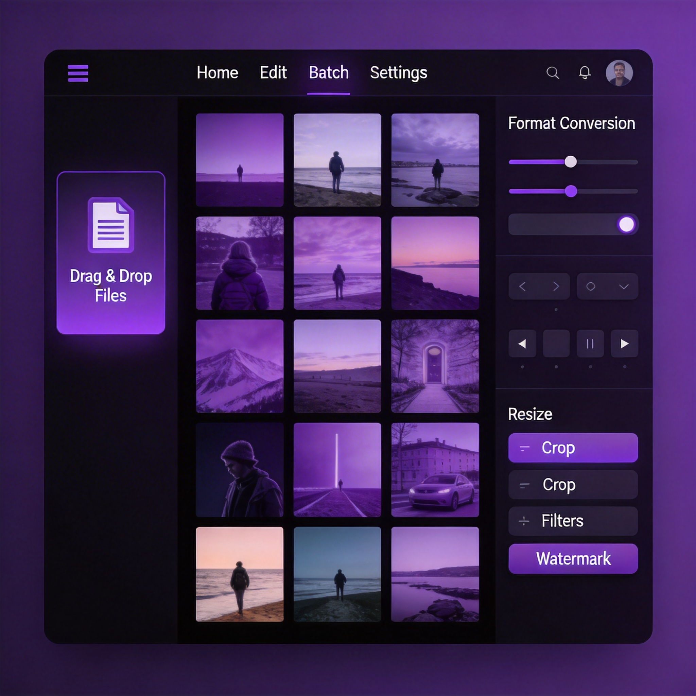

<div align="center">

#  SnapForge

**Professional Image Processing Platform**

一个现代化的专业图像处理平台，支持批量处理、格式转换、滤镜特效、水印添加等功能

[](https://nextjs.org/)
[](https://react.dev/)
[](https://www.typescriptlang.org/)
[](https://tailwindcss.com/)
[](LICENSE)

[在线演示](#) · [功能特性](#-功能特性) · [快速开始](#-快速开始) · [技术架构](#-技术架构)

</div>

---

## ✨ 功能特性

### 🖼️ 图像处理核心

| 功能 | 描述 |
|------|------|
| **格式转换** | 支持 JPEG、PNG、WebP、AVIF、TIFF、GIF 等主流格式互转 |
| **尺寸调整** | 智能缩放，支持多种模式（适应、填充、拉伸、裁剪） |
| **智能裁剪** | 自定义裁剪区域，支持预设比例（1:1、16:9、4:3 等） |
| **旋转翻转** | 任意角度旋转，支持水平/垂直翻转 |
| **滤镜效果** | 灰度、复古、锐化、模糊、浮雕、边缘检测等 10+ 滤镜 |
| **色彩调整** | 精细调节亮度、对比度、饱和度、锐度 |
| **水印添加** | 文字/图片水印，支持位置、透明度、平铺模式 |
| **边框装饰** | 自定义边框宽度、颜色、圆角 |

### 🚀 高级功能

- **批量处理** - 一次性处理数百张图片，自动队列管理
- **处理方案** - 预设方案一键应用，自定义方案保存/导入/导出
- **重复检测** - 智能感知哈希算法，快速识别相似/重复图片
- **统计分析** - 可视化仪表盘，追踪处理趋势和效率
- **图片对比** - 滑块/叠加/并排三种对比模式
- **EXIF 信息** - 完整展示拍摄参数和元数据

### 💻 用户体验

- **拖拽上传** - 支持拖拽、粘贴、点击多种上传方式
- **实时预览** - 处理效果即时可见
- **快捷键支持** - Ctrl+V 粘贴、Ctrl+A 全选、Delete 删除
- **批量下载** - 一键打包 ZIP 下载所有处理结果
- **深色模式** - 护眼主题自动切换
- **响应式设计** - 完美适配桌面和移动设备

---

## 📸 应用截图

<details>
<summary>点击展开查看截图</summary>

### 主界面


### 处理配置面板


### 图片对比


### 统计仪表盘


</details>

---

## 🛠️ 快速开始

### 环境要求

- Node.js 18.0 或更高版本
- pnpm 9.0 或更高版本

### 安装依赖

```bash
# 克隆仓库
git clone https://github.com/riceshowerX/SnapForge.git
cd SnapForge

# 安装依赖
pnpm install
```

### 开发模式

```bash
# 启动开发服务器
pnpm dev
```

打开 [http://localhost:5000](http://localhost:5000) 查看应用。

### 生产构建

```bash
# 构建生产版本
pnpm build

# 启动生产服务器
pnpm start
```

---

## 🏗️ 技术架构

### 技术栈

| 类别 | 技术 |
|------|------|
| **框架** | Next.js 16 (App Router) |
| **UI 库** | React 19 |
| **语言** | TypeScript 5 |
| **样式** | Tailwind CSS 4 + shadcn/ui |
| **状态管理** | Zustand |
| **图像处理** | Sharp (libvips) |
| **图表** | Recharts |
| **打包下载** | JSZip |

### 项目结构

```
SnapForge/
├── src/
│   ├── app/                    # Next.js App Router
│   │   ├── api/               # API 路由
│   │   │   ├── upload/        # 文件上传接口
│   │   │   ├── process/       # 图像处理接口
│   │   │   └── duplicates/    # 重复检测接口
│   │   ├── layout.tsx         # 根布局
│   │   ├── page.tsx           # 首页
│   │   └── globals.css        # 全局样式
│   ├── components/            # React 组件
│   │   ├── ui/               # shadcn/ui 基础组件
│   │   ├── ImageUploader.tsx # 图片上传组件
│   │   ├── ProcessConfigPanel.tsx # 配置面板
│   │   ├── ProcessingPanel.tsx    # 处理面板
│   │   ├── ImageCompare.tsx      # 图片对比
│   │   ├── ExifPanel.tsx         # EXIF 面板
│   │   ├── SchemeManager.tsx     # 方案管理
│   │   └── StatsDashboard.tsx    # 统计仪表盘
│   ├── lib/                   # 工具库
│   │   ├── image-processor.ts # 图像处理核心
│   │   └── utils.ts          # 通用工具函数
│   ├── store/                 # 状态管理
│   │   └── index.ts          # Zustand Store
│   └── types/                 # TypeScript 类型定义
│       └── index.ts          # 全局类型
├── public/                    # 静态资源
└── package.json              # 项目配置
```

### 核心模块

#### 图像处理流程


#### 处理管道

1. **裁剪** → 2. **旋转** → 3. **缩放** → 4. **特效** → 5. **滤镜** → 6. **边框** → 7. **水印** → 8. **格式转换**

---

## 📖 API 文档

### POST /api/upload

上传图片并获取预览信息

**请求**: `multipart/form-data`
- `file`: 图片文件

**响应**:
```json
{
  "name": "image.jpg",
  "size": 1024000,
  "type": "image/jpeg",
  "width": 1920,
  "height": 1080,
  "preview": "data:image/jpeg;base64,..."
}
```

### POST /api/process

处理单张图片

**请求**: `multipart/form-data`
- `file`: 图片文件
- `config`: JSON 格式的处理配置

**响应**: 处理后的图片二进制数据

### POST /api/duplicates

检测重复/相似图片

**请求**: `multipart/form-data`
- `files[]`: 多个图片文件
- `threshold`: 相似度阈值 (0.5-1.0)

**响应**:
```json
{
  "groups": [
    {
      "id": "group-1",
      "images": [...],
      "similarity": 0.95
    }
  ],
  "totalScanned": 10,
  "duplicatesFound": 3
}
```

---

## ⌨️ 快捷键

| 快捷键 | 功能 |
|--------|------|
| `Ctrl + V` | 从剪贴板粘贴图片 |
| `Ctrl + A` | 全选/取消全选图片 |
| `Delete` | 删除选中的图片 |
| `Ctrl + Enter` | 开始处理 |

---

## 🔒 安全特性

- **文件类型验证** - 通过 Magic Number 验证真实文件类型
- **文件大小限制** - 防止大文件攻击
- **输入验证** - 所有 API 参数严格校验
- **安全文件名** - 防止路径遍历攻击
- **错误处理** - 不暴露内部实现细节

---

## 🤝 贡献指南

欢迎贡献代码、报告问题或提出建议！

1. Fork 本仓库
2. 创建功能分支 (`git checkout -b feature/amazing-feature`)
3. 提交更改 (`git commit -m 'feat: add amazing feature'`)
4. 推送到分支 (`git push origin feature/amazing-feature`)
5. 创建 Pull Request

### 开发规范

- 使用 ESLint 和 TypeScript 进行代码检查
- 遵循 Conventional Commits 规范
- 新功能需要添加相应测试

---

## 📝 更新日志

### v1.0.0 (2024-01)

- ✨ 初始版本发布
- 🖼️ 完整的图像处理功能
- 🎨 专业级 UI 设计
- 📊 统计分析仪表盘
- 🔧 处理方案管理

---

## 📄 许可证

本项目基于 [MIT License](LICENSE) 开源。

---

<div align="center">

**Made with ❤️ by [riceshowerX](https://github.com/riceshowerX)**

如果这个项目对你有帮助，请给一个 ⭐️ Star 支持一下！

</div>
