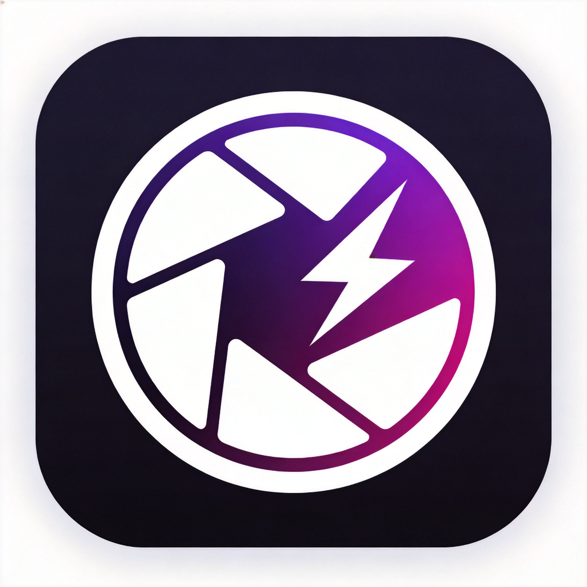

<div align="center">

<picture>
  <source media="(prefers-color-scheme: light)" srcset="public/logo.png">
  <source media="(prefers-color-scheme: dark)" srcset="public/logo.png">
  
</picture>

# SnapForge

**Professional Image Processing Platform — Batch Processing · Format Conversion · Filters · Watermarks · Smart Deduplication**

A fully local, out-of-the-box modern image processing workbench. No registration, no cloud upload — every image is processed on your own machine by a high-speed Sharp engine.

[](https://nextjs.org/)
[](https://react.dev/)
[](https://www.typescriptlang.org/)
[](https://tailwindcss.com/)
[](LICENSE)

[中文](README.md) · [Features](#-features) · [Quick Start](#-quick-start) · [Tech Stack](#-tech-stack) · [Project Structure](#-project-structure) · [Security](#-security)

</div>

---

## ✨ Features

### 🖼️ Core Image Processing

| Feature | Description | Formats |
|---------|-------------|---------|
| **Format Conversion** | Convert between major formats with quality & compression control | JPEG, PNG, WebP, AVIF, TIFF, GIF, BMP |
| **Resize** | Smart scaling with fit / fill / stretch / crop modes | - |
| **Smart Crop** | Custom crop region with presets: 1:1, 16:9, 4:3, 3:2, etc. | - |
| **Rotate & Flip** | Arbitrary rotation angle, vertical / horizontal flip (actually applied) | - |
| **Filters** | 15+ professional filters: grayscale, vintage, sharpen, blur, emboss, etc. | - |
| **Color Adjust** | Fine-tune brightness / contrast / saturation | - |
| **Watermark** | Text / image watermark, 9-position + tile mode (rotation & spacing supported) | - |
| **Border** | Custom border width, color, corner radius | - |
| **Preserve Metadata** | Keep EXIF / ICC metadata on output (toggleable) | - |
| **Target Compression** | Binary-search compression toward a target size (KB), ideal for web | JPEG, WebP |

### 🧠 Advanced Features

- **Batch Processing** — process hundreds of images at once, configurable concurrency (1-10) & stop-on-error
- **Processing Schemes** — one-click presets (Web Optimized, Watermark Protect, etc.), custom schemes with save / import / export (runtime-validated import)
- **Smart Dedup** — perceptual hashing finds similar / duplicate images, configurable threshold, real similarity scores
- **Stats Dashboard** — real metrics: processing trends, success rate, average time, space saved
- **EXIF Viewer** — client-side exifr parsing, full camera / lens / ISO / exposure details
- **Processing History** — last 20 local records, reusable configurations

### 🎨 UX

- **Multiple Upload** — drag & drop, paste (Ctrl+V), click; 4-way concurrent upload
- **Live Preview** — thumbnails & raw data stored separately (IndexedDB), instant feedback
- **Hotkeys** — Ctrl+V paste, Ctrl+A select all, Delete remove, Ctrl+Enter process
- **Batch Download** — one-click ZIP; rename templates with `{counter}` to avoid collisions
- **i18n** — Chinese / English toggle covering all UI text & preset names
- **Theme** — dark / light mode following system preference
- **Responsive** — desktop, tablet and mobile

---

## 🚀 Quick Start

### Requirements

| Environment | Requirement |
|-------------|-------------|
| **Node.js** | >= 18.0 (20+ recommended) |
| **pnpm** | >= 9.0 |

### Install & Run

```bash
# 1. Clone the repository
git clone https://github.com/riceshowerX/SnapForge.git
cd SnapForge

# 2. Install dependencies
pnpm install

# 3. Start the dev server (default port 5000)
pnpm dev

# 4. Open your browser
#    http://localhost:5000
```

### Production Deployment

```bash
# Build for production
pnpm build

# Start the production server (default port 5000)
pnpm start
```

### Code Quality

```bash
pnpm lint       # ESLint
pnpm ts-check   # TypeScript type check
```

---

## 🛠️ Tech Stack

| Category | Technology | Version |
|----------|------------|---------|
| Framework | Next.js (App Router) | 16.1 |
| UI | React | 19.2 |
| Language | TypeScript | 5 |
| Styling | Tailwind CSS + shadcn/ui | 4 |
| State | Zustand (persisted) | 5 |
| Imaging | Sharp (libvips) | 0.34 |
| Client ZIP | JSZip | 3.10 |
| EXIF | exifr | 7.1 |
| Validation | zod | 4.3 |

---

## 📁 Project Structure

```
SnapForge/
├── src/
│   ├── app/
│   │   ├── api/                    # API routes (upload / process / duplicates)
│   │   ├── layout.tsx              # Root layout (dynamic lang)
│   │   ├── page.tsx                # Home (single-page workbench)
│   │   ├── error.tsx               # Error boundary
│   │   └── global-error.tsx        # Global error boundary
│   ├── components/
│   │   ├── ui/                     # shadcn/ui primitives
│   │   ├── ImageUploader.tsx       # Upload (drag / paste / concurrent)
│   │   ├── ProcessingPanel.tsx     # Batch processing panel
│   │   ├── ProcessConfigPanel.tsx  # Processing configuration
│   │   ├── DuplicateDetector.tsx   # Smart deduplication
│   │   ├── ExifPanel.tsx           # EXIF viewer
│   │   ├── SchemeManager.tsx       # Scheme management (validated import)
│   │   ├── StatsDashboard.tsx      # Statistics dashboard
│   │   ├── ProcessingHistory.tsx   # Processing history
│   │   ├── ImagePreview.tsx        # Preview
│   │   └── ThemeToggle.tsx         # Theme switch
│   ├── lib/
│   │   ├── image-processor.ts      # Sharp processing pipeline
│   │   ├── file-validation.ts      # Unified file type/size/name validation
│   │   ├── config-schema.ts        # zod config schema + deep merge
│   │   ├── blob-store.ts           # IndexedDB raw blob storage
│   │   ├── request-guard.ts        # API request guard (Content-Length)
│   │   ├── rate-limit.ts           # Rate limiting (real IP + capacity cap)
│   │   ├── api-response.ts         # Unified API response format
│   │   ├── i18n.ts                 # i18n dictionary (zh / en)
│   │   └── utils.ts                # Utilities
│   ├── store/                      # Zustand state (persisted)
│   └── types/                      # TypeScript definitions
├── public/                         # Static assets
├── scripts/                        # dev / build / start scripts
├── AGENTS.md                       # Development conventions
├── package.json
└── README.md
```

---

## ⚙️ Configuration

| Item | Description |
|------|-------------|
| Dev / Prod port | 5000 (`scripts/dev.sh`, `scripts/start.sh`) |
| Max file size | 50 MB (`MAX_FILE_SIZE` in `file-validation.ts`) |
| Supported formats | JPEG / PNG / WebP / GIF (SVG / PDF rejected to reduce attack surface) |
| Large image policy | raw data (>2MB) stored in IndexedDB, 800×800 thumbnail for preview |
| Rate limits | `/api/upload` 30/min, `/api/process` 20/min, `/api/duplicates` 10/min |
| Language | toggle zh / en in the top-right, preference persisted to localStorage |

---

## 🔒 Security

- **SSRF Protection** — watermark remote URLs restricted to http/https, all private / reserved ranges (incl. IPv6) blocked after DNS resolution, fetch timeout + redirect re-validation
- **Magic Number Validation** — real type verified from file header bytes, client MIME never trusted
- **Decode Guardrails** — explicit `limitInputPixels` + `failOn: 'error'` on every sharp entry (decompression bombs)
- **Request Guard** — strict Content-Length check (missing / oversized → 413)
- **Hardened Rate Limiting** — keyed by real connection IP (forged headers ignored), bounded store
- **Filename Sanitization** — path traversal, Windows reserved device names, control chars, Unicode NFC
- **Runtime Config Validation** — zod schema, invalid params → friendly 400 instead of 500

---

## 🤝 Contributing

Issues and Pull Requests are welcome! How to contribute:

1. **Fork** the repo and create a feature branch: `git checkout -b feature/your-feature`
2. **Develop** — follow the conventions in `AGENTS.md` (React hooks, i18n, naming, security)
3. **Verify** — `pnpm lint` and `pnpm ts-check` must pass before submitting
4. **Commit** — follow Conventional Commits style (`feat:` / `fix:` / `refactor:`)
5. **Open a PR** — describe your changes and how they were verified

> 💡 New contributor? The pure functions in `src/lib/` (file-validation, config-schema) are great first contributions.

---

## 📄 License

[MIT License](LICENSE) — Copyright © 2026 [riceshowerX](https://github.com/riceshowerX)

---

<p align="center">
Built with ❤️ by <a href="https://github.com/riceshowerX">riceshowerX</a> · Local-first · Privacy-first
</p>
